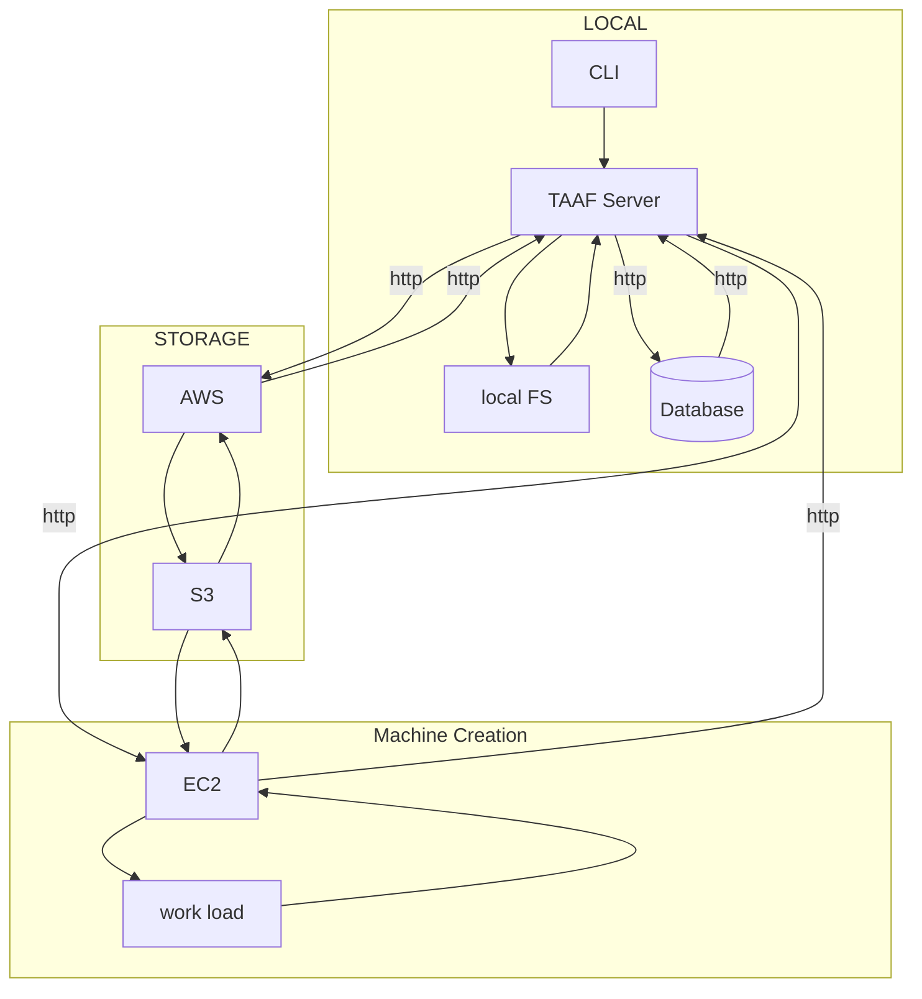

# TAAF

> transcode across a fleet

## what this do?

this pkg is a thingy i'm making in the hopes to streamline and automate the AI up scaling of DVD to 4k.

### background

i fukken love star trek, and i fukken love HQ video. to that end i was very excited about the blu-ray upscales of TNG they made from original source material. sadly, it wasn't worth the cost to the studio, and the process didn't return a meaningful profit. as such, they've elected to no do it to the other classic treks (at least for now). i thought that was dumb as hell, so i figured i'd make my own damn 4k trek, i'd make it good, in less than 2 decades, and allow others to do the same to any video!

## requirements

so this is gonna be expensive for you, almost no matter what. at the core of this thing i'm using AI Enhance from Topaz Labs. it costs $200 but i write software so i like to pay for it. especially as quality and cost have a direct relationship, i wanna strive for the highest quality output files.

on top of that, my EVGA 3090 at full tilt does .3 seconds a frame, or 15 hours per 45 minute episode. you're gonna need a phatty gpu, so instead of trying ton convince you to but $5000 in computers, let's just use AWS. so the workloads here are designed to run in AWS windows instances with a CUDA GPU.

as a list:

- topaz Enhance AI license
- AWS account creds

### local computer needs

so there are a few thing u wanna make sure you've done here:

- ansible is installed
- the remote computer has enhance ai installed and the CLI is ready

## design

this system is designed to work like this:

1. using cli, select a folder of video files
1. we create an S3 bucket, upload to it
1. we create an instance for each video in the bucket
1. we assign your transcode profile (or the default) to each box
1. trigger and monitor the renders
1. download the new renders from S3 as they complete
1. tear down the instance, delete S3 after all processing complete
1. notify the user

